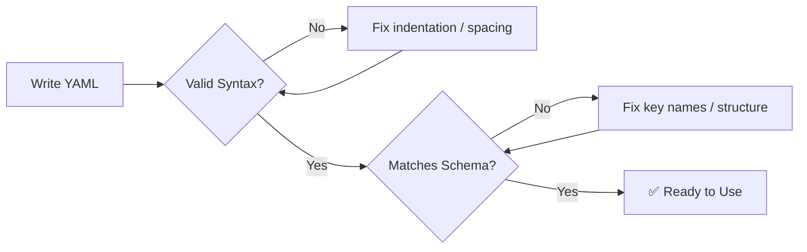

# 📦 YAML Configuration Examples


A collection of clean, validated **YAML configuration examples** — covering application configs, environment-based setups, and container/service definitions (Docker & Docker Compose style).

---

## 📑 Table of Contents

- [Overview](#-overview)
- [Repository Structure](#-repository-structure)
- [Examples](#-examples)
  - [Application Config](#1️⃣-application-config)
  - [Dev / Prod Environments](#2️⃣-dev--prod-environments)
  - [Container Services](#3️⃣-container-services)
  - [Docker Compose](#4️⃣-docker-compose)
- [Validation Flow](#-validation-flow)
- [Best Practices](#-best-practices)
- [License](#-license)

---

## 🔍 Overview

This repo contains beginner-to-intermediate **YAML** examples used for learning correct syntax, structure, and common config patterns — including application settings, multi-environment configs, and containerized services.

Each file has been checked for:

| ✅ Check | Description |
|---|---|
| Syntax validity | Proper indentation, spacing, and structure |
| Key naming | Consistent, spec-matching key names |
| Data types | Scalars vs. lists used correctly |
| Schema match | Matches intended target (custom schema or Docker Compose) |

---

## 🗂 Repository Structure

```
📁 yaml-examples/
 ├── 📄 application-config.yml
 ├── 📄 dev-prod-config.yml
 ├── 📄 container-services.yml
 ├── 📄 docker-compose.yml
 └── 📄 README.md
```

---

## 🧩 Examples

### 1️⃣ Application Config

```yaml
application:
  name: java_app
  version: 22.1
  environment: pod

server:
  host: localhost
  port: 8081

database:
  host: db_server
  port: 8080
  name: soumya
```

> Defines core app metadata, server binding, and database connection details.

---

### 2️⃣ Dev / Prod Environments

```yaml
application:
  development:
    environment: dev
    host: localhost
    port: 8085
    database: my_sql

  production:
    environment: pro
    host: localhost
    port: 8080
    database: mongodb
```

> Separates configuration per environment — swap `development` ↔ `production` without touching app logic.

---

### 3️⃣ Container Services

```yaml
containers:
  - name: nginx
    image: nginx:v1
    container_port: 80
    host_port: 8080

  - name: nodejs
    image: nodejs:v3
    container_port: 3000
    host_port: 3000
```

> A custom schema mapping each service's container port to its exposed host port.

---

### 4️⃣ Docker Compose

```yaml
services:
  nginx:
    image: nginx:v1
    ports:
      - "8080:80"

  nodejs:
    image: nodejs:v1
    ports:
      - "3000:3000"

  redis:
    image: redis:v1
    ports:
      - "6379:6379"
```

> Real, runnable `docker-compose.yml` — start all services with:
> ```bash
> docker-compose up
> ```

---

## 🔄 Validation Flow



---

## ✅ Best Practices

- 🔹 Use **spaces**, never tabs, for indentation
- 🔹 Always put a space after `-` in list items (`- item`, not `-item`)
- 🔹 Use **scalars** for single values, **lists** only when multiple values are possible
- 🔹 Keep key names **consistent** with the schema you're targeting (custom vs. Docker Compose vs. Kubernetes)
- 🔹 Never commit real credentials/passwords in plaintext YAML
- 🔹 Validate with a linter before deploying: [yamllint](https://github.com/adrienverge/yamllint) or [yamllint.com](http://www.yamllint.com/)

---

## 📄 License

This project is licensed under the **MIT License** — free to use, modify, and share.

---

<p align="center">Made with ⚙️ and clean indentation</p>
